# Sire 自定义包开发

Sire1.29 引进了自定义包（Sire Customized Package）的功能，以下为 RK [原文](https://tieba.baidu.com/p/6297758882?pid=127922812804&cid=0#127922812804)：

> **随着311技术普及，越来越多的人可以改代码，因此sire提供了自定义包加载功能，未来各路大神的自定义包都可以以DLC的形式加载，比如火神的功勋解锁特技：**
> 
> 
> **把自定义包放到相应目录里，就可以使用了，还可以改参数哦~~**

但这些自定义包的开发基本只在技术圈内大佬之间进行研究，网上关于这方面的介绍少之又少。作为 311+sire 的忠实拥趸，长期享受各位大佬的用爱发电的成果，有时也会冒出一些改进游戏的想法，因此决定自行研究下如何编写 sire 自定义包，并在此记录，以作参考。

（PS：本人有一定编程经验，但对汇编反汇编这块还是小白一枚，一切从1（这个项目）开始，有何不对之处望各位大佬指正）


**主要资源**

- 本项目[311MemoryResearch](https://github.com/sjn4048/311MemoryResearch)是我了解 sire 工作原理的重要来源
- [big-guy-examples](./big-guy-examples/)文件夹中为一些大佬的自定义包，是我制作自定义包的重要参考，感谢各位大佬的辛勤付出。
- [examples](./examples/)中为本教程（姑且称之为教程~）的自制包。


**开发环境**

参考[sjn4048](https://github.com/sjn4048)在项目[311MemoryResearch](https://github.com/sjn4048/311MemoryResearch)中提及的内容，结合自己最近学习开发的一些经验，这里也给一些参考：

- **IDA Pro**：汇编反汇编神器，必装，网上有破解的，在此我就不多介绍了，网上自取。下面为一些我认为比较有用的插件：
  - [HexCopy](https://github.com/OALabs/hexcopy-ida)：IDA 插件，用于快速将反汇编代码复制为编码的十六进制字节
- Hex WorkShop：用于改.exe，暂时还没用到
- Cheat Engine：喜羊羊与RK都在用的动态调试神器，可以动态查看运行时的内存。暂时还没用到，因为目前的修改都比较简单。


## 第零弹：Sire 自定义包的原理

首先明确下 Sire 自定义包的概念：

- 文件名后缀为 scp，放入 sire 的 customize 目录下生效，同名的 scpv 文件为对应的参数配置文件
- scp文件内容一般为 xml 文本，也有一些二进制文件（可能加密过？ TODO: 需找大佬确认）
- sire 的工作原理本质是对 SAN11PK 进程的内存中的机械码和数据进行修改，所以自定义包也是基于这一点，可以看到大佬们的自定义包中的 xml 文件都是描述对内存中的数据进行修改的
- 包中最重要的部分是 `<Codes>` 标签，包含了一系列修改内存的操作`<Code>`, `<Code>`中包含了代码的地址`<Address>`、启用该功能时的机器码`EnableCode`和不启用该功能时的机器码`DisableCode`（大部分情况下为原机器码）。


下面是一个简单的显示武将真实忠诚度包 [显示真实忠诚.scp](./big-guy-examples/显示真实忠诚.scp)的例子：

```xml
<?xml version="1.0" encoding="UTF-8"?>
<CustomModifyPackage>
	<PackageName>显示真实忠诚</PackageName>
	<PackageAuthor>龙哥</PackageAuthor>
	<PackageDiscription>显示超过100的忠诚的真实数值</PackageDiscription>
	<CustomModifyItems>
		<CustomModifyItem>
			<Caption>开启</Caption>
			<Enabled>true</Enabled>
			<Codes>
				<Code>
					<Description>代码</Description>
					<Address>004C8A9B</Address><!--长度:5-->
					<EnableCode>B8 64 00 00 00</EnableCode>
					<DisableCode>BE 64 00 00 00</DisableCode>
				</Code>	
			</Codes>
		</CustomModifyItem>
	</CustomModifyItems>
</CustomModifyPackage>
```
（疑问：观察到每个`<Address>`后面都有一个长度的注释，实测为非必需，猜测自定包文件是由某编辑工具生成？ TODO: 需找大佬确认）

做的操作是将地址为 004C8A9B 处的机械码 BE 64 00 00 00 用 B8 64 00 00 00 替换，

在[内存资料](../内存资料/)全局搜索 004C8A9B 可以搜到：

```
[命令编号为23：返回武将忠诚度]
004C8A8B - 0f b6 b7 ac 00 00 00       - movzx esi,byte ptr [edi+000000ac]  esi = 忠诚度
004C8A92 - 83 fe 64                   - cmp esi,64
004C8A95 - 0f 8c e4 03 00 00          - jl 004c8e7f
004C8A9B - be 64 00 00 00             - mov esi,00000064
004C8AA0 - 8b c6                      - mov eax,esi                        返回武将忠诚度
004C8AA2 - 5e                         - pop esi
004C8AA3 - 5b                         - pop ebx
004C8AA4 - 5f                         - pop edi
004C8AA5 - c3                         - ret
```

这段汇编代码主要处理的是返回某个武将的忠诚度。我们可以逐行分析它的功能：

1. **004C8A8B - 0f b6 b7 ac 00 00 00 - movzx esi, byte ptr [edi+000000ac]**
   - `movzx esi, byte ptr [edi+000000ac]`：这个指令从`edi`寄存器指向的地址偏移`0xAC`处读取一个字节，并将其零扩展后存储到`esi`寄存器中。这里的`edi`为武将指针，`esi`存放的是武将的忠诚度。

2. **004C8A92 - 83 fe 64 - cmp esi, 64**
   - `cmp esi, 64`：将`esi`中的值（忠诚度）与十六进制的`64`（即十进制的100）进行比较。

3. **004C8A95 - 0f 8c e4 03 00 00 - jl 004c8e7f**
   - `jl 004c8e7f`：如果`esi`中的值小于100（即忠诚度小于100），则跳转到地址`004c8e7f`。`jl`是“jump if less”（如果小于则跳转）的缩写。

4. **004C8A9B - be 64 00 00 00 - mov esi, 00000064**
   - `mov esi, 00000064`：将十六进制的`64`（即十进制的100）赋值给`esi`寄存器。如果前面的比较没有跳转，说明忠诚度不小于100，这里将忠诚度设为100。

5. **004C8AA0 - 8b c6 - mov eax, esi**
   - `mov eax, esi`：将`esi`寄存器中的值（此时的忠诚度值）复制到`eax`寄存器中。`eax`寄存器通常用于函数的返回值，所以这里是将忠诚度值准备好作为返回值。

6. **004C8AA2 - 5e - pop esi**
   - `pop esi`：从栈顶弹出一个值到`esi`寄存器，恢复之前保存的`esi`值。

7. **004C8AA3 - 5b - pop ebx**
   - `pop ebx`：从栈顶弹出一个值到`ebx`寄存器，恢复之前保存的`ebx`值。

8. **004C8AA4 - 5f - pop edi**
   - `pop edi`：从栈顶弹出一个值到`edi`寄存器，恢复之前保存的`edi`值。

9. **004C8AA5 - c3 - ret**
   - `ret`：返回调用函数。这条指令会从栈顶弹出返回地址，并跳转到这个地址，恢复到调用该函数的地方继续执行。

这段代码的功能是读取一个武将的忠诚度，并确保返回的忠诚度不会超过100。如果忠诚度超过100，则将其限制在100以内，然后将这个值返回给调用者。

而我们做的修改是将地址 `004C8A9B` 处的代码改为：

```assembly
B8 64 00 00 00  ; mov eax, 00000064
```
这条指令的含义是：将十六进制的 64 (十进制 100) 赋值给 `eax` 寄存器，而`esi`的值还是原来的，然后下一条将`esi`值加载给`eax`返回，就达到了返回真实忠诚度的作用了。

（PS: 这里实际使得武将忠诚度上限不再是100了，感觉对其他忠诚度的操作如登用武将会有影响，不是很推荐）


## 第一弹：制作一个显示五维和的自定义包

了解了自定义包的原理，接下来实现一个简单的功能：武将列表显示五维和。

要实现该功能，一个是要了解如何在武将列表添加1列，另一个是要了解如何取五维值。


### 首先学习下大佬们的自定义包

我们可以在大佬们的自定义包中找到有类似功能的例子，比如[显示相性、与君主相性差、喜好武将和厌恶武将.scp](./big-guy-examples/显示相性、与君主相性差、喜好武将和厌恶武将.scp)中的代码：

```xml
...
		<CustomModifyItem>
			<Caption>相性差为与玩家势力君主相性差</Caption>
			<Enabled>TRUE</Enabled>
			<Codes>
				<Code>
					<Description>代码</Description>
					<Address>008BD490</Address>
					<EnableCode>40 01 95 00 13</EnableCode>
					<DisableCode>A8 CF 8B 00 07</DisableCode>
				</Code>
				<Code>
					<Description>代码</Description>
					<Address>00950140</Address>
					<EnableCode>01 00 00 00 15 00 00 00 4A 00 00 00 56 00 00 00 2F 00 00 00 49 00 00 00 06 00 00 00 11 00 00 00 0E 00 00 00 6A 00 00 00 6B 00 00 00 6C 00 00 00 6D 00 00 00 6E 00 00 00 6F 00 00 00 70 00 00 00 71 00 00 00 72 00 00 00 73 00 00 00</EnableCode>
					<DisableCode>00 00 00 00 00 00 00 00 00 00 00 00 00 00 00 00 00 00 00 00 00 00 00 00 00 00 00 00 00 00 00 00 00 00 00 00 00 00 00 00 00 00 00 00 00 00 00 00 00 00 00 00 00 00 00 00 00 00 00 00 00 00 00 00 00 00 00 00 00 00 00 00 00 00 00 00</DisableCode>
				</Code>
				<Code>
					<Description>代码</Description>
					<Address>004C8EBC</Address><!--长度:4-->
					<EnableCode>E0 01 95 00</EnableCode>
					<DisableCode>6A 8A 4C 00</DisableCode>
				</Code>	
				<Code>
					<Description>代码</Description>
					<Address>009501E0</Address><!--长度:40-->
					<EnableCode>0F B6 05 D8 1A 20 07 8B 04 85 1C 1A 20 07 50 B9 58 19 20 07 E8 A7 08 B4 FF 8B 40 04 50 8B CF E8 7C 9D B3 FF 5E 5B 5F C3</EnableCode>
					<DisableCode>00 00 00 00 00 00 00 00 00 00 00 00 00 00 00 00 00 00 00 00 00 00 00 00 00 00 00 00 00 00 00 00 00 00 00 00 00 00 00 00</DisableCode>
				</Code>	
				<Code>
					<Description>代码</Description>
					<Address>007ECABC</Address><!--长度:6-->
					<EnableCode>AC DB A9 CA AE 74</EnableCode>
					<DisableCode>A5 40 A5 4E 00 00</DisableCode>
				</Code>	
			</Codes>
		</CustomModifyItem>
...
```

通过 **IDA Pro** 分析：

**008BD490** 处为数据段，内容为 A8 CF 8B 00 07，表示一个地址 和 数字7：

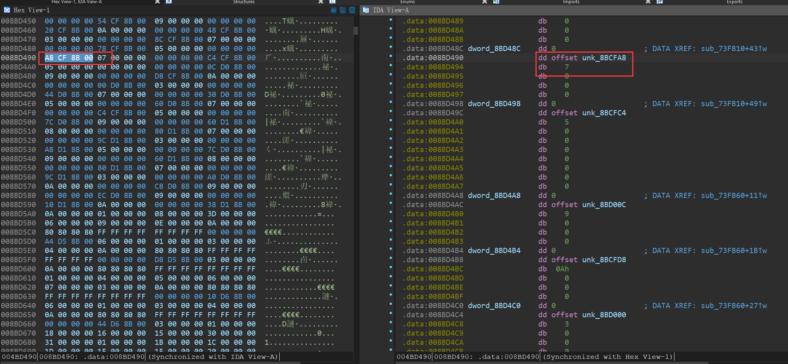

其中 unk 意为 unknown，表示该地址类型未知，8BD00C为地址，地址后面的 07 应该表示的是这个数组大小，跳到 8BD00C ：

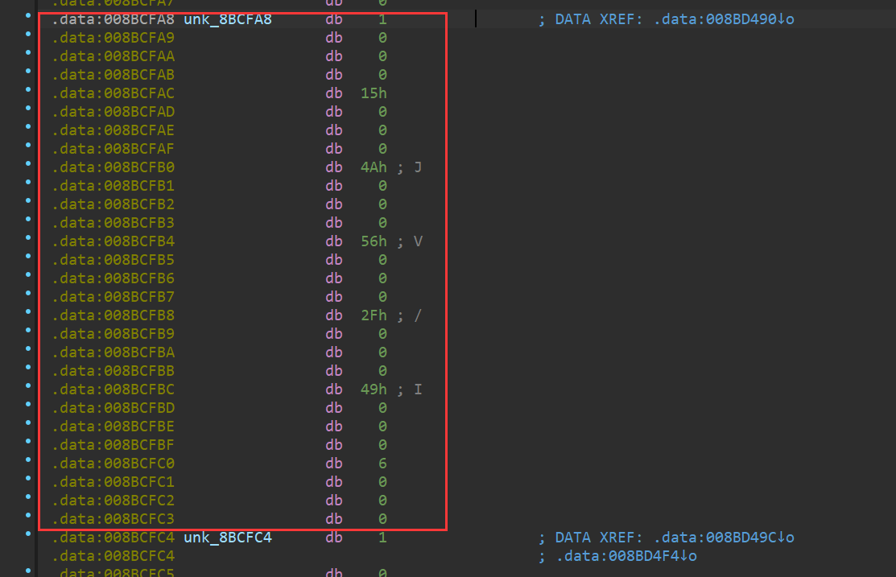

发现值为：1, 15h(=21), 4Ah(=74), 56h(=86), 2Fh(=47), 49h(73), 6 刚好7个

所以该 Code 的作用就很明显了，将地址为 8BD00C 的大小为 7 的数组地址为 950140 大小为 13 的数组。至于数组的作用，后面再看。


**00950140** 处也为数据段，不过原内容全为0，是原程序没用到的内存，在这里定义了 19 个数，分别为：

01, 15, 4A, 56, 2F, 49, 06, 11, 0E, 6A, 6B, 6C, 6D, 6E, 6F, 70, 71, 72, 73

上述数字为16进制，这里就不转换了，共13h(19)个数，因此这两个 Code 合起来就是替换了一下数组，对比可以发现在原数组的基础上加了12个数，暂时还不知道做什么的。


**004C8EBC**处也是替换东西，只不过替换的不是数组，而是 loc，即 location，可以理解为函数块，004C8EBC存的原函数块的地址为 4C8A6A，

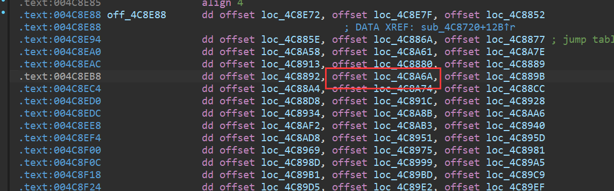

查内存资料可得知这个函数是返回武将世代 ID 的，由于不常用，被替换也问题不大

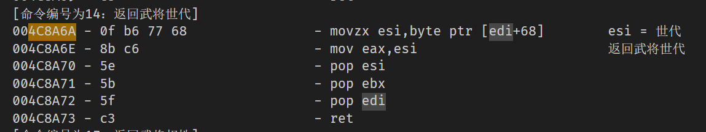

而用于替换的函数的地址为 **9501E0**， 即为下个 Code 定义的新函数。


**009501E0** 定义了一个新函数，尝试分析下这这段函数的功能：

（PS1：009501E0 实际已经处于 data 段了，一般是不放函数的，一个是需要执行权限，另一个是安全性问题，不过既然是魔改san11，就管不了这么多了）

（PS2：san11pk内存中存在一大块未被使用的部分，可以用来添加自定义的函数或数据，但应注意与其他自定包开发者协调，避免冲突）

新函数的机器码为：

```
0F B6 05 D8 1A 20 07 8B 04 85 1C 1A 20 07 50 B9 58 19 20 07 E8 A7 08 B4 FF 8B 40 04 50 8B CF E8 7C 9D B3 FF 5E 5B 5F C3
```

我们用 **IDA Pro** 工具将这段机器码反汇编（具体工具获取以及如何操作我就不介绍了，网上自取~），得到的汇编代码如下：

根据给定的机器码，重新描述其反汇编结果：

```assembly
0F B6 05 D8 1A 20 07     movzx   eax, byte ptr [07201AD8]
8B 04 85 1C 1A 20 07     mov     eax, dword ptr [eax*4 + 07201A1C]
50                       push    eax
B9 58 19 20 07           mov     ecx, 07201958
E8 A7 08 B4 FF           call    00490AA0   ; Call to GetCountryPtr 
8B 40 04                 mov     eax, [eax+4]
50                       push    eax
8B CF                    mov     ecx, edi
E8 7C 9D B3 FF           call    00489F80   ; Call to CalcXiangxingDiff
5E                       pop     esi
5B                       pop     ebx
5F                       pop     edi
C3                       retn
```

1. **`movzx eax, byte ptr [07201AD8]`**
   
   - `0F B6 05 D8 1A 20 07`：从地址 `07201AD8` 读取一个字节( 从后面的分析看，该字节应存储的是当前选定势力的序号)，并零扩展到 `eax`。
   
2. **`mov eax, dword ptr [eax*4 + 07201A1C]`**
   - `8B 04 85 1C 1A 20 07`：从地址 `07201A1C` 加上 `eax` * 4 的偏移处读取一个双字（4 字节）到 `eax`。
   - 这里地址`07201A1C`对应内容如下，表示一个长度为 `0CEh`（206 个字节）的字节数组，每个字节初始化为 `0`。`db` 表示定义字节（define byte），`0CEh` 是十六进制数 `206`，`dup(0)` 表示重复初始化为 `0`。
   
   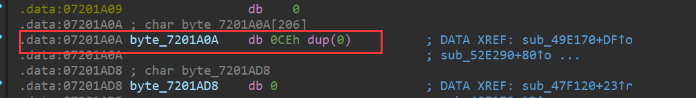
   
   - 这里的`07201A1C`应该是势力 ID 数组，在实际游戏时会为每个势力生成唯一ID。
   - PS：根据这里的限制，最大势力数应为 206/4=51 个？
   
3. **`push eax`**
   
   - `50`：将 `eax` 的值压入栈中，即将势力 ID 作为下一个调用函数的第一个参数。
   
4. **`mov ecx, 07201958`**
   - `B9 58 19 20 07`：将立即数 `07201958` 加载到 `ecx`，这个数字是啥意思暂按下不表。

5. **`call 00490AA0`**
   
   - `E8 A7 08 B4 FF`：调用 `00490AA0` 处的函数，根据内存资料查得该函数功能为：根据势力ID获取势力指针。该函数详细讲解建后面，最后读到的势力指针存在 `eax` 寄存器 。
   - PS：这里补充下汇编的基础知识，在x86和x86-64架构中，`E8` 是一个短调用（short call）指令的操作码，用于调用相对于下一条指令的跳转偏移位置处的函数或子程序。这里下一条指令的地址是 009501F9，而 `E8 A7 08 B4 FF` 是小端序存储的偏移，实际偏移应为 FFB408A7, 则实际函数位置即 `009501F9 + FFB408A7 = 00490AA0`。
   
6. **`mov eax, [eax+4]`**
   - `8B 40 04`：将 `eax` 寄存器中地址加 4 的位置的值读取到 `eax`，从后面看，这个取得应该是该势力的君主的ID。

7. **`push eax`**
   - `50`：将 `eax` 的值压入栈中，即将势力的君主ID作为下一个调用函数的第一个参数。

8. **`mov ecx, edi`**
   
   - `8B CF`：将 `edi` 的值加载到 `ecx`（从后面分析看，这里 `edi` 为当前武将的人物指针）。
   
9. **`call 00489F80`**
   
   - `E8 7C 9D B3 FF`：调用 `00489F80` 处的函数, 根据内存资料查得该函数功能为：计算A与B的相性差(push B的ID, ecx=A的指针)，最后函数会往栈中推3个值，具体函数讲解见后面。
   
10. **`pop esi`**
    
    - `5E`：从栈中弹出一个值到 `esi`。
    
11. **`pop ebx`**
    - `5B`：从栈中弹出一个值到 `ebx`。

12. **`pop edi`**
    - `5F`：从栈中弹出一个值到 `edi`。

13. **`retn`**
    - `C3`：从子程序返回。


要完整理解这段代码，还得去读一下其中调用的两个函数。

首先是**00490AA0** 处的函数，其反汇编结果如下：

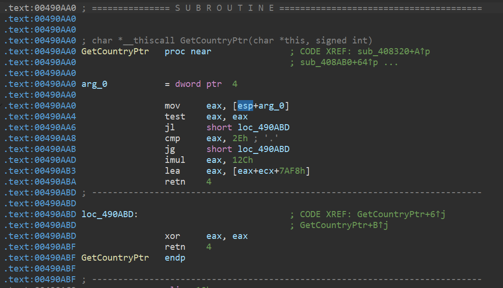

这段代码是函数 `GetCountryPtr` 的汇编代码，该函数的作用是根据传入的势力ID参数获取一个势力指针。以下是对代码的解释：

1. `GetCountryPtr` 是一个函数，它是一个近函数（near），意味着它是一个本地函数，不会跨越段边界。
2. 首先，通过 `mov eax, [esp+arg_0]` 指令将参数 `this` 存储的地址加载到寄存器 `eax` 中。【PS: 这里解释下为什么`esp+arg_0`就是this参数，`esp`（Extended Stack Pointer）是x86架构中的一个特殊寄存器。它主要用于管理栈操作。在调用函数时，返回地址被压入栈，参数按照从右到左顺序依次压入栈，在进入函数 `GetCountryPtr` 后，`esp` 指向栈顶，即返回地址。通常，在标准调用约定下，第一个参数位于 `[esp + 4]`，因为栈顶保存了返回地址（即调用函数返回后程序继续执行的位置），返回地址占用4个字节。】根据前面分析，压入栈的是一个代表势力ID的 双字（4 字节），因此这里 eax 即为势力 ID。【PS：从后面看，势力ID是一个比较小的数组，应该就是0~46范围的数，感觉用不到双字，不知道是不是有别的用途】
3. 然后，通过 `test eax, eax` 指令检查 `eax` 是否为零。如果为零，则跳转到 `loc_490ABD` 处。
4. 如果 `eax` 不为零，接着执行 `cmp eax, 2Eh` 指令，将 `eax` 与 `2Eh`（46） 进行比较。如果 `eax` 大于 `2Eh`（46），则跳转到 `loc_490ABD` 处。
5. 如果 `eax` 不大于 `2Eh`，则执行 `imul eax, 12Ch`，将 `eax` 乘以 `12Ch`（或者说乘以 300），然后执行 `lea eax, [eax+ecx+7AF8h]`，`lea` 指令是 Load Effective Address 的缩写，它用于将一个有效地址加载到目标操作数中。尽管它的名字中包含了 "load" 这个词，但实际上它并不从内存中加载数据，而是计算并加载一个有效地址。这里实际是计算地址`eax+ecx+7AF8h`，然后将该地址加载到`eax`。其中`ecx`在前面提到了，加载了立即数 `07201958`，这里`07201958+7AF8=7209450`, 查询内存资料知， 7209450即为所有势力数据的起始地址，每个势力数据占12Ch(=300)字节，用势力指针加偏移便可获得对应的属性。因此这里的`eax+ecx+7AF8h`即为该势力的指针。（PS: 这个立即数`07201958`颇有magic number的意思，在内存中可以搜到在调用势力相关的函数之前都会有 `mov ecx,07201958` 这么一段）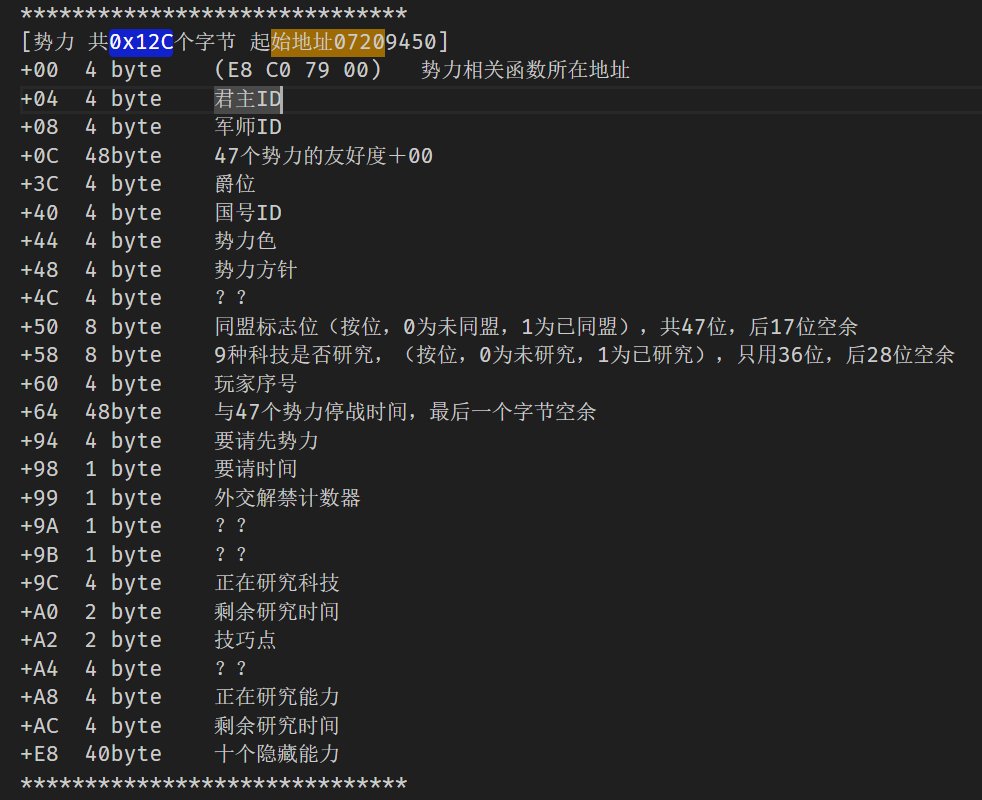
6. 最后，通过 `retn 4` 指令返回，其中 `4` 表示从堆栈中移除4个字节的参数。
7. 如果 `eax` 为零，则跳转到 `loc_490ABD` 处。在该处，通过 `xor eax, eax` 指令将 `eax` 清零，然后通过 `retn 4` 指令返回，效果相当于返回了一个空指针。


然后再是 **00489F80** 这个函数，其反汇编结果如下：

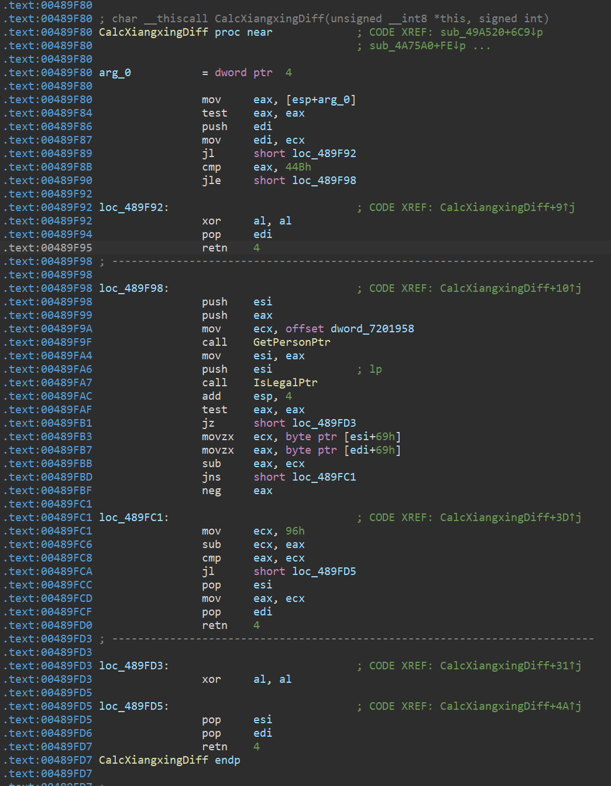

这段反汇编代码定义的是计算两武将相位差的函数，根据前面分析，压入栈的参数是本势力君主的ID，而 eax 和 edi 寄存器里存的是当前武将的人物指针。下面是对代码逐条的分析和解释。

1. **函数入口和参数读取**：
    ```assembly
    .text:00489F80                 mov     eax, [esp+arg_0]
    ```
    将栈上的参数（君主ID）加载到 `eax` 中。

2. **参数有效性检查**：
    ```assembly
    .text:00489F84                 test    eax, eax
    .text:00489F86                 push    edi
    .text:00489F87                 mov     edi, ecx
    .text:00489F89                 jl      short loc_489F92
    .text:00489F8B                 cmp     eax, 44Bh
    .text:00489F90                 jle     short loc_489F98
    ```
    检查 `eax` 是否为负值或大于 `44Bh` (1099)。如果无效，跳转到 `loc_489F92`。

3. **无效参数处理**：
    ```assembly
    .text:00489F92 loc_489F92:                             ; CODE XREF: CalcXiangxingDiff+9↑j
    .text:00489F92                 xor     al, al
    .text:00489F94                 pop     edi
    .text:00489F95                 retn    4
    ```
    将 `al` 清零（返回0），恢复 `edi` 并返回。【PS：在x86汇编中，`al` 是 `eax` 寄存器的最低 8 位部分。`eax` 是一个 32 位寄存器，而它的各个部分可以分别作为 8 位、16 位或 32 位寄存器来使用。具体的分配如下：

    - `al`：`eax` 的低 8 位
    - `ah`：`eax` 的高 8 位
    - `ax`：`eax` 的低 16 位
    - `eax`：整个 32 位寄存器
    
    】
    
4. **有效参数处理**：
    ```assembly
    .text:00489F98 loc_489F98:                             ; CODE XREF: CalcXiangxingDiff+10↑j
    .text:00489F98                 push    esi
    .text:00489F99                 push    eax
    .text:00489F9A                 mov     ecx, offset dword_7201958
    .text:00489F9F                 call    GetPersonPtr
    .text:00489FA4                 mov     esi, eax
    .text:00489FA6                 push    esi             ; lp
    .text:00489FA7                 call    IsLegalPtr
    .text:00489FAC                 add     esp, 4
    ```
    将君主ID作为参数调用 `GetPersonPtr` 函数，获取君主的人物指针到 `esi`。然后调用 `IsLegalPtr` 检查指针合法性。

5. **合法性检查**：
   
    ```assembly
    .text:00489FAF                 test    eax, eax
    .text:00489FB1                 jz      short loc_489FD3
    ```
    如果指针不合法，跳转到 `loc_489FD3`。
    
6. **相性差异计算**：
   
    ```assembly
    .text:00489FB3                 movzx   ecx, byte ptr [esi+69h]
    .text:00489FB7                 movzx   eax, byte ptr [edi+69h]
    .text:00489FBB                 sub     eax, ecx
    .text:00489FBD                 jns     short loc_489FC1
    .text:00489FBF                 neg     eax
    ```
    获取 `esi` 和 `edi` 对象的69h偏移处的字节值，并计算它们的差值（绝对值）。
    
7. **相性差异与固定值对比**：
    ```assembly
    .text:00489FC1 loc_489FC1:                             ; CODE XREF: CalcXiangxingDiff+3D↑j
    .text:00489FC1                 mov     ecx, 96h
    .text:00489FC6                 sub     ecx, eax
    .text:00489FC8                 cmp     eax, ecx
    .text:00489FCA                 jl      short loc_489FD5
    ```
    比较相性差异 `eax` 与固定值 `96h` 的差值。如果 `eax` 小于差值，跳转到 `loc_489FD5`。

8. **相性差异返回处理**：
    ```assembly
    .text:00489FCC                 pop     esi
    .text:00489FCD                 mov     eax, ecx
    .text:00489FCF                 pop     edi
    .text:00489FD0                 retn    4
    ```
    如果 `eax` 大于等于差值，返回较小的值。

9. **非法指针处理和最终返回**：
   
    ```assembly
    .text:00489FD3 loc_489FD3:                             ; CODE XREF: CalcXiangxingDiff+31↑j
    .text:00489FD3                 xor     al, al
    .text:00489FD5
    .text:00489FD5 loc_489FD5:                             ; CODE XREF: CalcXiangxingDiff+4A↑j
    .text:00489FD5                 pop     esi
    .text:00489FD6                 pop     edi
    .text:00489FD7                 retn    4
    .text:00489FD7 CalcXiangxingDiff endp
    .text:00489FD7
    .text:00489FD7 ; ---------------------------------------------------------------------------

- `loc_489FD3` 和 `loc_489FD5` 处理函数在指针非法的情况下，将 `al` 清零（返回值为 0）。 
- 恢复 `esi` 和 `edi` 寄存器的值。
- `retn 4` 指令用于返回并清理函数调用时的堆栈参数。它会弹出 4 字节（1 个参数）的返回地址，并恢复执行上下文。

最终得到的相性差值存在 `eax` 寄存器中。


综上可见，最终将原来取武将世代的函数替换成了计算与君主相性差的函数，这些函数会在你打开武将列表时被调用，并计算相应值。


那这些值是如何显示到列表中的呢？

我们先看下不启动这个自定义包时的武将列表：

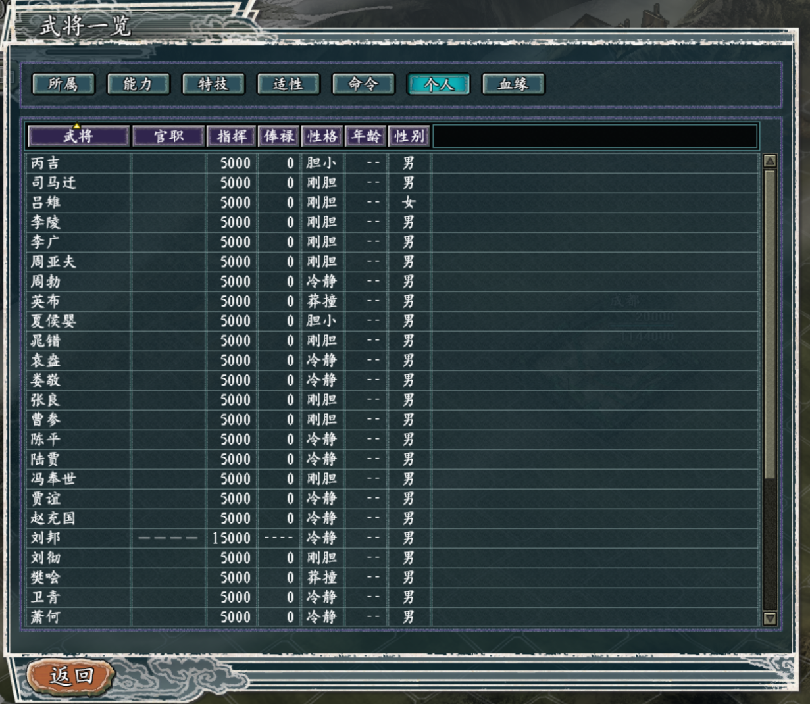

然后是应用自定义包后的效果：

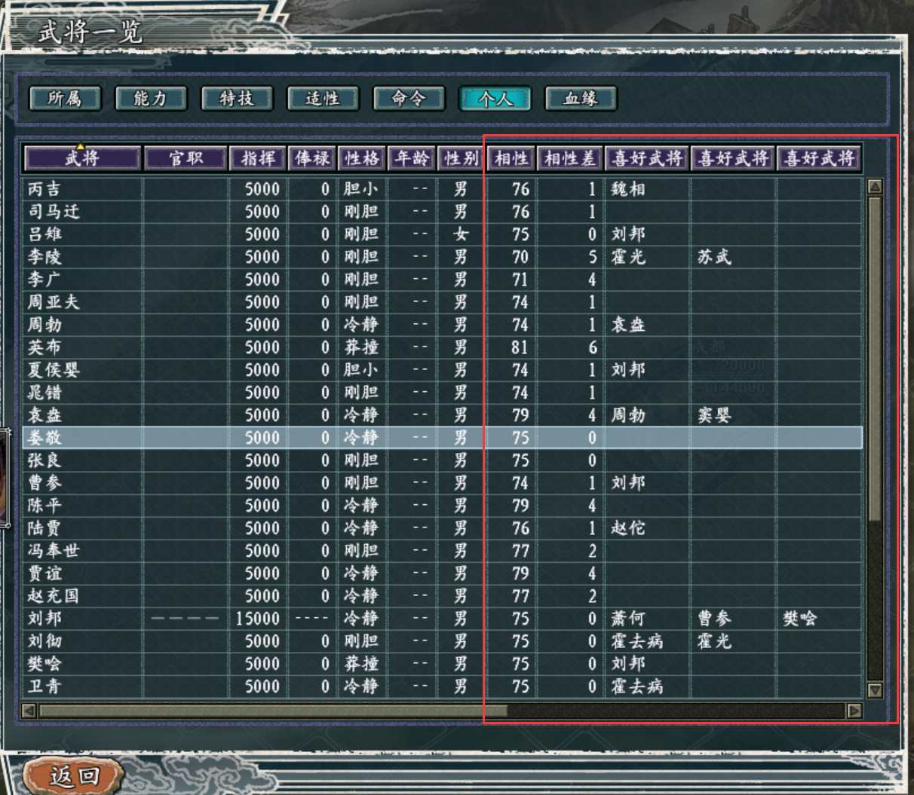

（未完整显示，右侧还有几列）

我们可以发现，原来的武将个人列表只有7列，现在变成了19列，多了12列。7和19这两个数字是不是很熟悉，就是前面被替换的数组的大小。由此我们可以推测，这个数组实际管的是武将个人列表会显示哪些列，如上面改的数组是：

```
01, 15, 4A, 56, 2F, 49, 06, 11, 0E, 6A, 6B, 6C, 6D, 6E, 6F, 70, 71, 72, 73
```

而这些具体的数字，应该是获取人物信息的函数的标识，比如获取人物的名字的函数标识是1，第一列全通过调用1对应的函数取得名字。

经过查询内存资料和分析IDA反汇编结果，发现果然如此，所有函数都存在起始地址为`004C8E88`的地方：

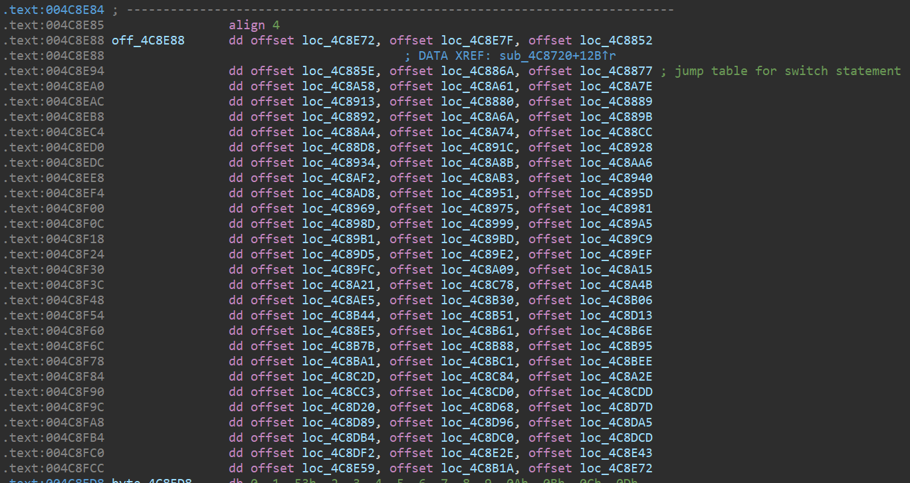

武将个人页数组第9个数为0E，而我们前面替换的获取武将世代的函数(loc_4C8A6A)就属于其中第14个函数，对应0E，也会是巧合吗？为了搞清楚其中的关系，我们继续深挖。

搜索函数表的引用，发现就1处：

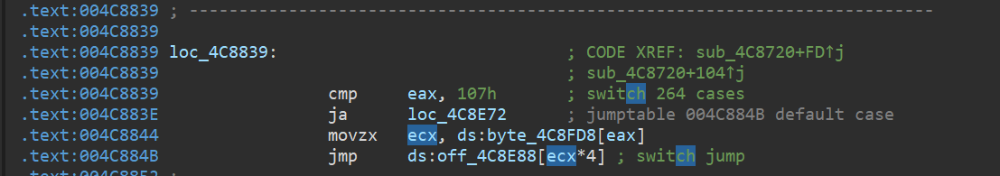

可见这里的序号 ecx 是从一个地址为 **4C8FD8** 处的字节数组中取出来的，跳到该地址，发现就位于函数映射表下面，可以推测是一个命令编号-函数序号的映射表，命令表里存的是各函数在上述函数映射表中的序号。

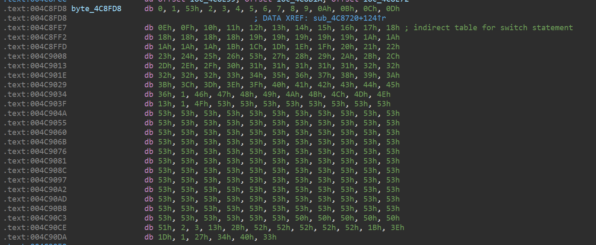

顺腾摸瓜可以找到获取武将信息的主函数位于**004C8720**：

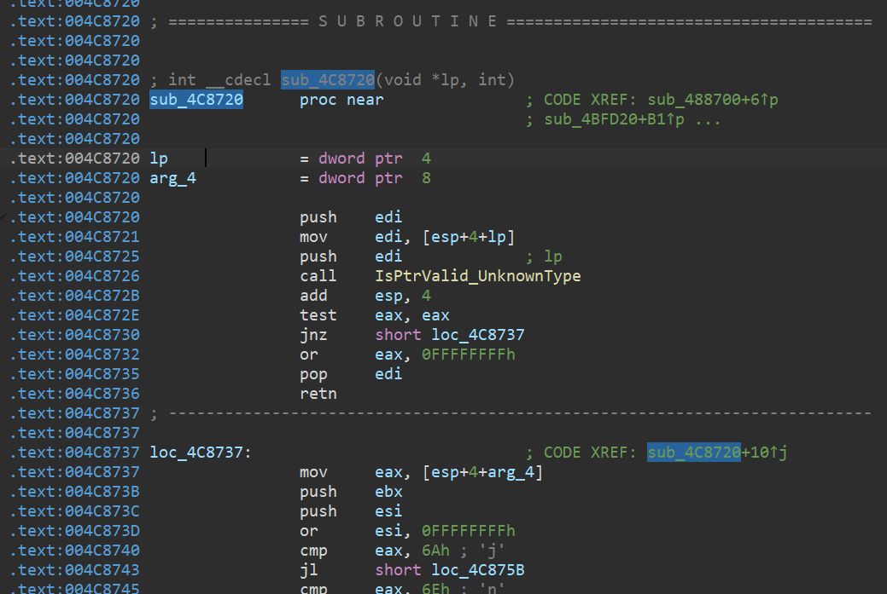

压入栈的参数有两个，调用前应先push命令编码, 再push武将指针，进入该函数后，先将武将指针加载至 **edi**（PS：有同学可能会疑惑，之前不是说的 esp+4 是第一个参数吗，这里`mov     edi, [esp+4+lp]`不是 esp+8 取得第二个参数吗，注意因为前面 `push edi`了，`esp` 当前指向 `push edi` 之后的位置，所以 `esp + 4` 是原始 `esp` 的位置），再判断 **edi**是否有效，如果有效（返回结果**eax**不为0）则跳转到后面各种case， 最终返回结果都存到**eax**寄存器了。


这下我们清楚了，获取武将信息需要武将指针和命令编号，那上面数组中数字自然就是命令编号了。上面的 0Eh 即 14，查命令列表（注意序号从0开始）得到对应的函数序号为 0Dh 即 13，再去查函数列表，得到对应函数地址为 4C8A6A，即返回武将世代 ID的函数。


我们将原本获取武将世代的函数替换成获取相性差的函数并生效了，现在如果我们将函数替换的代码取消掉，则武将相性差一列则会显示武将世代，验证如下：

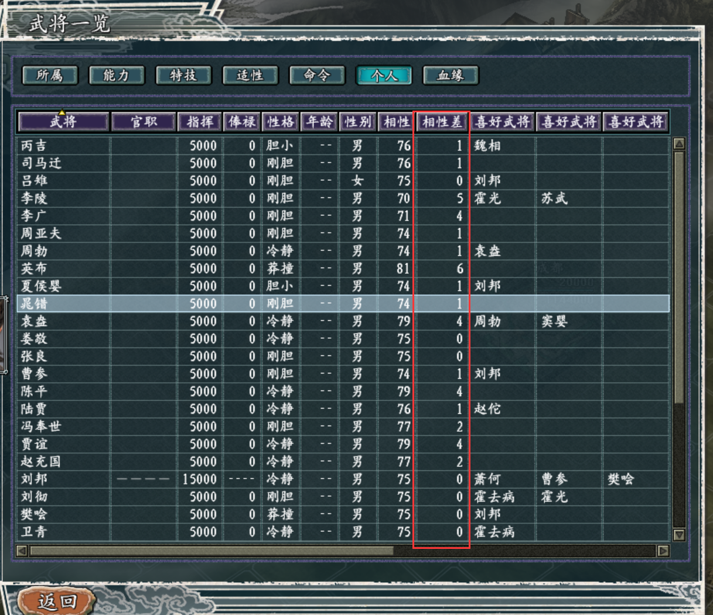


至此我们知道了武将列表中的值是怎么来的了，但还有一点不明，就是这个“相性差”的列标题是如何来的。看自定义包还剩最后一个 Code，估计就是干这个事的吧。


最后一个 Code 是在 **007ECABC** 处加 `AC DB A9 CA AE 74`, 查 IDA 知这里是只读数据段，基本存的都是各种字符串，我们先看看这里原来的文字是什么


根据前面查到的资料，三国志11中用的是【BIG5】编码储存繁体汉字的，我编写了一个汉字和16进制表示的BIG5编码之间互转的python脚本 [string_tool.py](./string_tool.py)，可以得到这里编码`A5 40 A5 4E`对应的汉字为：


我们再看看替换的汉字是什么：

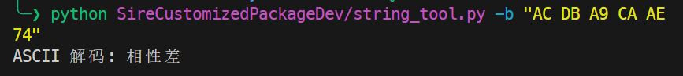

所以这段就是将 世代 替换成 相性差 的。

至此我们算是学完了这个包的原理，接下来我们开始做自己的包。


### 制作显示五维和的自定义包

首先，我们要添加的五维和应该在武将列表的能力页中，尝试找到其对应的数组

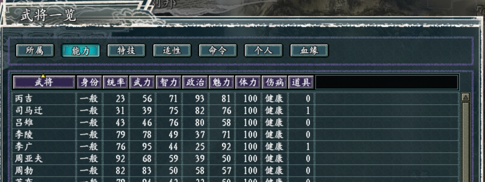

正常有10列，我们在之前个人页数组对应的地址**008BD490**附近找长度为10的数组的地址，

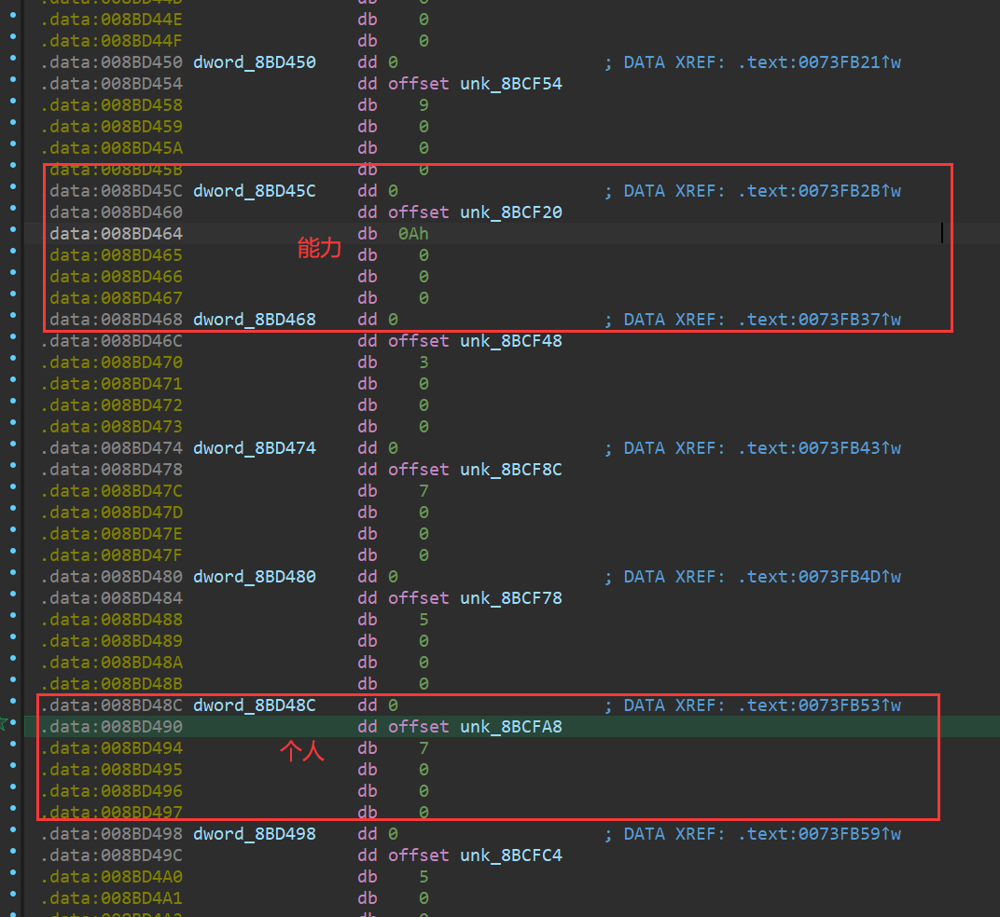

发现其实这里排着的顺序和武将列表里各页顺序是一一对应的，因此找到了我们要修改的第一个地方是`008BD460`, 我们尝试在魅力和体力之间加一列五维和，原数组地址为`008BCF20` , 内容为：

```
01 00 00 00 14 00 00 00  44 00 00 00 45 00 00 00
46 00 00 00 47 00 00 00  48 00 00 00 28 00 00 00
39 00 00 00 54 00 00 00
```

我们在倒数第3列左边增加一列，具体什么数字呢？

其实根据前面的分析，我们知道武将的所有属性其实已经固定下来了，如果要增加新的属性，只能覆盖掉已有的属性，像前面的显示相性差自定义包就是覆盖武将世代的属性。**由于目前不知道其他大神的自定义包修改的内存范围和覆盖了哪些属性，为了避免未知的风险，我们暂时选则原显示相性差包的修改内存地址和覆盖技能，等后续了解了哪些地址可以被修改（对游戏没影响且和其他自定义包不冲突）再做修改**。

我们在数组倒数第3列左边增加一列 0E 00 00 00：

```
01 00 00 00 14 00 00 00  44 00 00 00 45 00 00 00
46 00 00 00 47 00 00 00  48 00 00 00 0E 00 00 00
28 00 00 00 39 00 00 00  54 00 00 00
```

得到如下代码：

```
                <Code>
                    <Description>修改武将能力页数组地址</Description>
                    <Address>008BD460</Address>
                    <EnableCode>40 01 95 00 0B</EnableCode>
                    <DisableCode>20 CF 8B 00 0A</DisableCode>
                </Code>
                <Code>
                    <Description>武将能力页新数组</Description>
                    <Address>00950140</Address>
                    <EnableCode>01 00 00 00 14 00 00 00 44 00 00 00 45 00 00 00 46 00 00 00 47 00 00 00 48 00 00 00 0E 00 00 00 28 00 00 00 39 00 00 00 54 00 00 00</EnableCode>
                    <DisableCode>01 00 00 00 14 00 00 00 44 00 00 00 45 00 00 00 46 00 00 00 47 00 00 00 48 00 00 00 28 00 00 00 39 00 00 00 54 00 00 00</DisableCode>
                </Code>
                <Code>
                    <Description>替换命令编号0E对应的函数地址</Description>
                    <Address>004C8EBC</Address>
                    <EnableCode>E0 01 95 00</EnableCode>
                    <DisableCode>6A 8A 4C 00</DisableCode>
                </Code>
```


接下来就是实现计算武将五维和的函数了，这里我用 **IDA Pro**编写了如下代码，左边为内存地址，中间为机械码，右边为编写的汇编码：

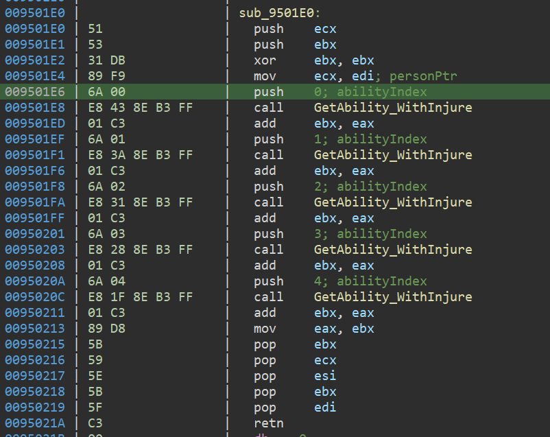

逻辑很简单，只不过要注意这里 `GetAbility_WithInjure` 函数的用法：

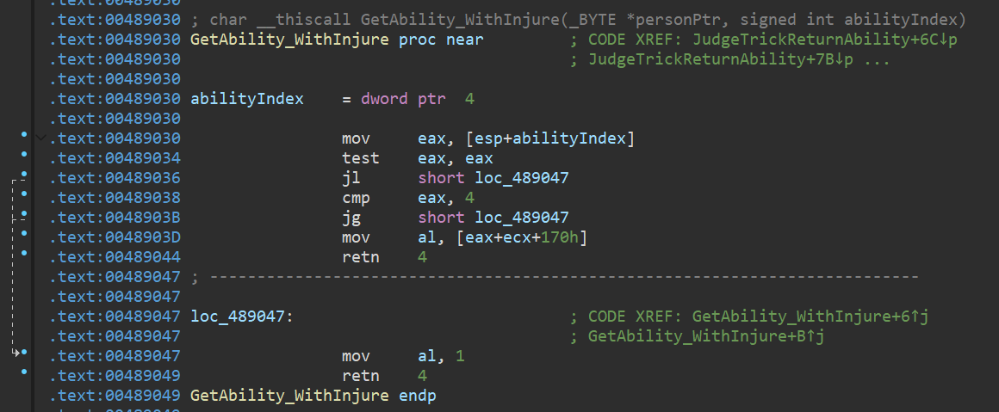

它位于**00489030**，功能是获取武将指定受伤病影响的显示属性，输入为(push属性序号, ecx=武将指针)。

另外最后的3个pop是必须的，与其他函数表中的函数保持一致即可。

得到代码为：

```xml
                <Code>
                    <Description>替换命令编号0E对应的函数地址</Description>
                    <Address>004C8EBC</Address>
                    <EnableCode>E0 01 95 00</EnableCode>
                    <DisableCode>6A 8A 4C 00</DisableCode>
                </Code>
                <Code>
                    <Description>取五维和的函数</Description>
                    <Address>009501E0</Address>
                    <EnableCode>51 53 31 DB 89 F9 6A 00 E8 43 8E B3 FF 01 C3 6A 01 E8 3A 8E B3 FF 01 C3 6A 02 E8 31 8E B3 FF 01 C3 6A 03 E8 28 8E B3 FF 01 C3 6A 04 E8 1F 8E B3 FF 01 C3 89 D8 5B 59 5E 5B 5F C3</EnableCode>
                    <DisableCode>00 00 00 00 00 00 00 00 00 00 00 00 00 00 00 00 00 00 00 00 00 00 00 00 00 00 00 00 00 00 00 00 00 00 00 00 00 00 00 00 00 00 00 00 00 00 00 00 00 00 00 00 00 00 00 00 00 00 00</DisableCode>
                </Code>
```


最后是将字符串“世代”替换成“五维和”：

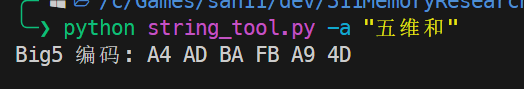

得到代码：

```
                <Code>
                    <Description>修改文字“世代”至“五维和”</Description>
                    <Address>007ECABC</Address>
                    <EnableCode>A4 AD BA FB A9 4D</EnableCode>
                    <DisableCode>A5 40 A5 4E</DisableCode>
                </Code>
```

最终的代码见 [examples/显示五维和.scp](./examples/显示五维和.scp).

我们装载上看看效果：

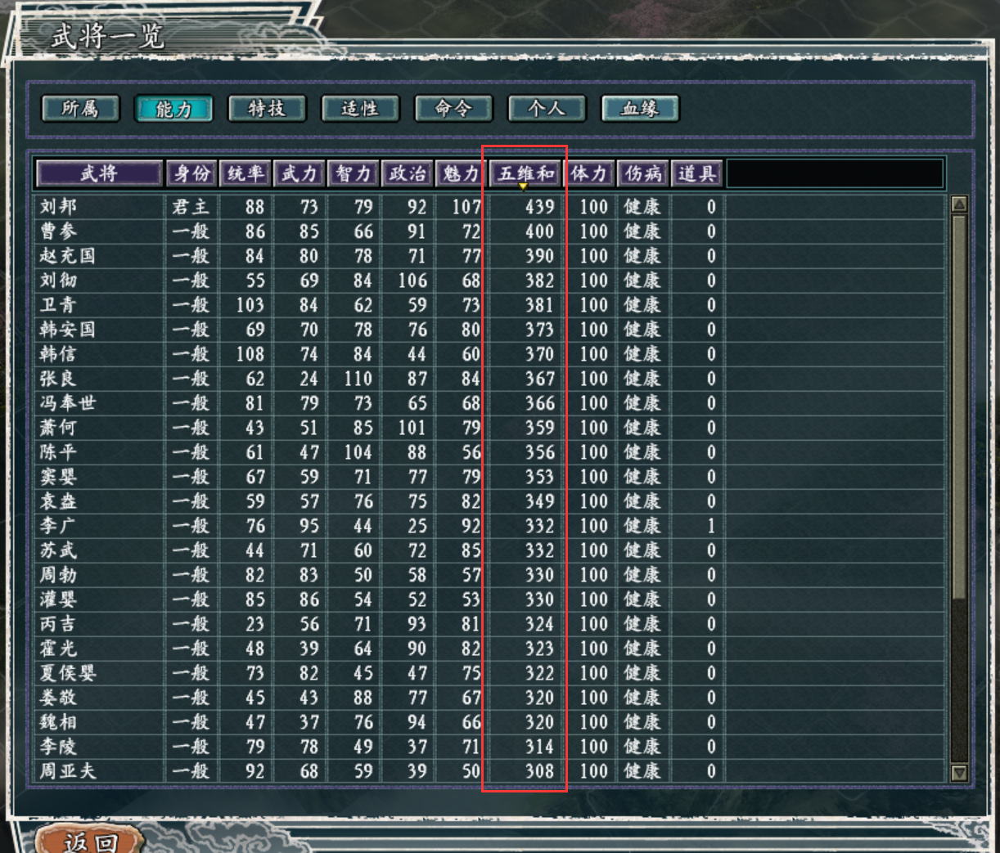

符合预期！

